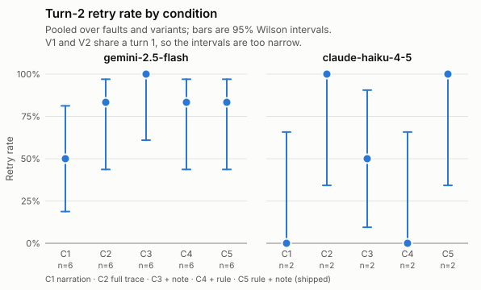

# Stage 1 pilot report: `synthetic`

Generated by `research/pilot/harness/report.ts` from `research/pilot/ws/_tests/20260925T110033-29748/020-synthetic-run/results/synthetic/summary.csv`, `research/pilot/ws/_tests/20260925T110033-29748/020-synthetic-run/runs/synthetic/manifest.json` and the raw records it lists. No number here was typed by hand; section 11 maps each to its source.

## 1. Problems first

**RETRIED_FAILED branches: 2.** The brief reads these as a sign of a harness bug; `script_run` = 0 means the retry was a bash call that never ran the script (possible for F01 and F02).

| model | trial | branch | fault | script_run | render |
|---|---|---|---|---|---|
| gemini-2.5-flash | t0002 | V2_C3 | F03 | 1 | research/pilot/ws/_tests/20260925T110033-29748/020-synthetic-run/results/synthetic/renders/t0002.md |
| gemini-2.5-flash | t0005 | V1_C1 | F01 | 0 | research/pilot/ws/_tests/20260925T110033-29748/020-synthetic-run/results/synthetic/renders/t0005.md |

**Infra errors and missing records, all passes: 4** (2 still counted after the infra-error pass; the rest were replaced by a retry).

| unit | id | model | state | reason | pass | still counted |
|---|---|---|---|---|---|---|
| turn1 | t0004 | gemini-2.5-flash | INFRA_ERROR | API_ERROR | original | no |
| turn1 | t0008 | claude-haiku-4-5 | MISSING_RECORD | planned, but no record was written | original | yes |
| branch | t0005/V2_C1 | gemini-2.5-flash | INFRA_ERROR | API_ERROR | original | no |
| control | k0005 | claude-haiku-4-5 | MISSING_RECORD | planned, but no record was written | original | yes |

**Provider rejections: 0.**

**Tool calls with `..` or `_stash` in their arguments (flagged, not excluded): 0 turns.**

- Turn-1 states where the scorer disagrees with the runner: 0
- Turns whose tool calls don't match the harness tool log: 0
- Rows without a price in SUPPORTED_CHAT_MODELS: 0
- Units not run (budget stop or run stop): 0
- Turns that hit the 15-step cap: 0

**Deviations from the brief** (from the run manifest):

- **DX** synthetic deviation

## 2. Manifest

**Scope: every result in this report comes from Windows with Git Bash.** The system prompt tells the model it is on Windows and should use POSIX commands.

C5 approximates shipped easycode rather than reproducing it: all five branches share a turn 1 run with P_norule and no NOTE, while shipped easycode would also give turn 1 the rule and the NOTE.

| item | value |
|---|---|
| run id | synthetic |
| created |  |
| purpose |  |
| easycode commit run against | `` |
| harness commit | `` |
| Windows |  () |
| Bun |  () |
| Git Bash | ``,  |
| Git |  (in Git Bash);  (on PATH) |
| grep on the harness PATH | not found |
| AI SDK | ai , @ai-sdk/google , @ai-sdk/anthropic , @ai-sdk/openai  |
| settings | BUDGET_USD 75, REPS 2, faults F01 F03, step cap 15, turn limit undefined ms, retries undefined, concurrency undefined per provider, controls undefined per type |
| prompt hashes (cwd replaced by `<CWD>`) | P_full ``, P_norule ``; exact per-trial hashes are in each record |

| model requested | provider | model returned | provider options |
|---|---|---|---|
| gemini-2.5-flash | google | gemini-2.5-flash | `null` |
| claude-haiku-4-5 | anthropic | claude-haiku-4-5-20251001 | `null` |

## 3. Accounting

Turn-1 states, one per planned trial after the infra-error pass:

| model | fault | VALID | INVALID_NO_ATTEMPT | INVALID_MODIFIED | INVALID_EMPTY | INFRA_ERROR | NOT_RUN | MISSING_RECORD | total |
|---|---|---|---|---|---|---|---|---|---|
| gemini-2.5-flash | F01 | 2 | 0 | 0 | 0 | 0 | 0 | 0 | 2 |
| gemini-2.5-flash | F03 | 1 | 1 | 0 | 0 | 0 | 0 | 0 | 2 |
| **gemini-2.5-flash** | **all** | **3** | **1** | **0** | **0** | **0** | **0** | **0** | **4** |
| claude-haiku-4-5 | F01 | 1 | 0 | 0 | 0 | 0 | 0 | 0 | 1 |
| claude-haiku-4-5 | F03 | 0 | 0 | 1 | 0 | 0 | 0 | 1 | 2 |
| **claude-haiku-4-5** | **all** | **1** | **0** | **1** | **0** | **0** | **0** | **1** | **3** |

Turn-2 branches (effective after the infra-error pass) and controls:

| model | branches RAN | branches INFRA_ERROR | branches PROVIDER_REJECTED | branches NOT_RUN | branch rows replaced by a retry | controls OK | controls INFRA_ERROR | controls NOT_RUN | controls MISSING_RECORD |
|---|---|---|---|---|---|---|---|---|---|
| gemini-2.5-flash | 30 | 0 | 0 | 0 | 1 | 3 | 0 | 0 | 0 |
| claude-haiku-4-5 | 10 | 0 | 0 | 0 | 0 | 1 | 0 | 0 | 1 |

## 4. Primary table: retry rate

Share of turn-2 branches that re-attempted the failed operation (Section 5.1 definition), with 95% Wilson intervals. Only branches that ran count.

| model | C1 NARRATION | C2 FULL_TRACE | C3 NARRATION_NOTE | C4 NARRATION_RULE | C5 SHIPPED |
|---|---|---|---|---|---|
| gemini-2.5-flash | 50.0% [18.8%, 81.2%] (3/6) | 83.3% [43.6%, 97.0%] (5/6) | 100.0% [61.0%, 100.0%] (6/6) | 83.3% [43.6%, 97.0%] (5/6) | 83.3% [43.6%, 97.0%] (5/6) |
| claude-haiku-4-5 | 0.0% [0.0%, 65.8%] (0/2) | 100.0% [34.2%, 100.0%] (2/2) | 50.0% [9.5%, 90.5%] (1/2) | 0.0% [0.0%, 65.8%] (0/2) | 100.0% [34.2%, 100.0%] (2/2) |

Split by variant:

| model | variant | C1 | C2 | C3 | C4 | C5 |
|---|---|---|---|---|---|---|
| gemini-2.5-flash | V1 | 33.3% [6.1%, 79.2%] (1/3) | 66.7% [20.8%, 93.9%] (2/3) | 100.0% [43.9%, 100.0%] (3/3) | 66.7% [20.8%, 93.9%] (2/3) | 100.0% [43.9%, 100.0%] (3/3) |
| gemini-2.5-flash | V2 | 66.7% [20.8%, 93.9%] (2/3) | 100.0% [43.9%, 100.0%] (3/3) | 100.0% [43.9%, 100.0%] (3/3) | 100.0% [43.9%, 100.0%] (3/3) | 66.7% [20.8%, 93.9%] (2/3) |
| claude-haiku-4-5 | V1 | 0.0% [0.0%, 79.3%] (0/1) | 100.0% [20.7%, 100.0%] (1/1) | 0.0% [0.0%, 79.3%] (0/1) | 0.0% [0.0%, 79.3%] (0/1) | 100.0% [20.7%, 100.0%] (1/1) |
| claude-haiku-4-5 | V2 | 0.0% [0.0%, 79.3%] (0/1) | 100.0% [20.7%, 100.0%] (1/1) | 100.0% [20.7%, 100.0%] (1/1) | 0.0% [0.0%, 79.3%] (0/1) | 100.0% [20.7%, 100.0%] (1/1) |

The V1 and V2 branches of a trial share one turn 1, so they are not independent. The pooled intervals treat them as independent and are therefore too narrow.

## 5. Paired comparisons (exploratory)

Pairs are the two branches of one trial and variant under C1 and under the other condition, both run. b = only C1 retried; c = only the other condition retried. Every p-value is an exact McNemar test (two-sided binomial on b + c) and is **exploratory**.

| model | comparison | pairs | both retried | neither | b: C1 only | c: other only | exact McNemar p |
|---|---|---|---|---|---|---|---|
| gemini-2.5-flash | C1 vs C2 | 6 | 3 | 1 | 0 | 2 | 0.500 (exploratory) |
| gemini-2.5-flash | C1 vs C3 | 6 | 3 | 0 | 0 | 3 | 0.250 (exploratory) |
| gemini-2.5-flash | C1 vs C4 | 6 | 3 | 1 | 0 | 2 | 0.500 (exploratory) |
| gemini-2.5-flash | C1 vs C5 | 6 | 2 | 0 | 1 | 3 | 0.625 (exploratory) |
| claude-haiku-4-5 | C1 vs C2 | 2 | 0 | 0 | 0 | 2 | 0.500 (exploratory) |
| claude-haiku-4-5 | C1 vs C3 | 2 | 0 | 1 | 0 | 1 | 1.000 (exploratory) |
| claude-haiku-4-5 | C1 vs C4 | 2 | 0 | 2 | 0 | 0 | 1.000 (exploratory) |
| claude-haiku-4-5 | C1 vs C5 | 2 | 0 | 0 | 0 | 2 | 0.500 (exploratory) |

## 6. Per-fault retry rates in C1

| fault | gemini-2.5-flash | claude-haiku-4-5 |
|---|---|---|
| F01 Bash unavailable | 75.0% [30.1%, 95.4%] (3/4) | 0.0% [0.0%, 65.8%] (0/2) |
| F03 Test script missing | 0.0% [0.0%, 65.8%] (0/2) | n/a (n = 0) (0/0) |

## 7. Controls (no fault, no history)

Retry-equivalent: a bash call that ran `run_tests.sh`. Recovered-equivalent: that, plus the fixture's token in a tool result and in the final text.

| model | control | ran | retry-equivalent | recovered-equivalent |
|---|---|---|---|---|
| gemini-2.5-flash | T1 | 2 | 50.0% [9.5%, 90.5%] (1/2) | 50.0% [9.5%, 90.5%] (1/2) |
| gemini-2.5-flash | V2 | 1 | 100.0% [20.7%, 100.0%] (1/1) | 100.0% [20.7%, 100.0%] (1/1) |
| claude-haiku-4-5 | T1 | 1 | 100.0% [20.7%, 100.0%] (1/1) | 100.0% [20.7%, 100.0%] (1/1) |
| claude-haiku-4-5 | V2 | 0 | n/a (n = 0) (0/0) | n/a (n = 0) (0/0) |

## 8. Outcome categories

`looks_stale` is a text heuristic on NO_TOOL branches for human review only; it feeds no headline number.

| model | condition | RECOVERED | RETRIED_NOT_REPORTED | RETRIED_FAILED | OTHER_TOOL_ONLY | NO_TOOL | NO_TOOL with looks_stale | total |
|---|---|---|---|---|---|---|---|---|
| gemini-2.5-flash | C1 | 2 | 0 | 1 | 0 | 3 | 3 | 6 |
| gemini-2.5-flash | C2 | 5 | 0 | 0 | 1 | 0 | 0 | 6 |
| gemini-2.5-flash | C3 | 5 | 0 | 1 | 0 | 0 | 0 | 6 |
| gemini-2.5-flash | C4 | 4 | 1 | 0 | 0 | 1 | 1 | 6 |
| gemini-2.5-flash | C5 | 5 | 0 | 0 | 0 | 1 | 1 | 6 |
| claude-haiku-4-5 | C1 | 0 | 0 | 0 | 0 | 2 | 2 | 2 |
| claude-haiku-4-5 | C2 | 2 | 0 | 0 | 0 | 0 | 0 | 2 |
| claude-haiku-4-5 | C3 | 1 | 0 | 0 | 0 | 1 | 1 | 2 |
| claude-haiku-4-5 | C4 | 0 | 0 | 0 | 1 | 1 | 1 | 2 |
| claude-haiku-4-5 | C5 | 2 | 0 | 0 | 0 | 0 | 0 | 2 |

## 9. Cost

Actual spend from token usage and easycode's SUPPORTED_CHAT_MODELS prices, over every row including infra errors and replaced attempts (they were paid for). Gemini thinking tokens are billed as output.

| model | turn 1 | C1 | C2 | C3 | C4 | C5 | controls | total |
|---|---|---|---|---|---|---|---|---|
| gemini-2.5-flash | $0.0027 | $0.0041 | $0.0041 | $0.0041 | $0.0041 | $0.0041 | $0.0020 | **$0.0250** |
| claude-haiku-4-5 | $0.0030 | $0.0030 | $0.0030 | $0.0030 | $0.0030 | $0.0030 | $0.0015 | **$0.0195** |
| **all models** |  |  |  |  |  |  |  | **$0.0445** |

| model | input tokens | output tokens | reasoning tokens | billed output tokens |
|---|---|---|---|---|
| gemini-2.5-flash | 37000 | 3700 | 1850 | 5550 |
| claude-haiku-4-5 | 13000 | 1300 | 0 | 1300 |

## 10. Threshold check (Section 10, point estimates)

| threshold | observed | result |
|---|---|---|
| H1: in C1, some model's stale rate >= 20% over >= 40 valid branches | gemini-2.5-flash: stale 50.0% over n = 6; claude-haiku-4-5: stale 100.0% over n = 2 | not met |
| H2: some model's C1 and C2 retry rates differ by >= 10 points | gemini-2.5-flash: C1 50.0%, C2 83.3%, gap 33.3 points; claude-haiku-4-5: C1 0.0%, C2 100.0%, gap 100.0 points | **met** |
| H3: pooled over models, C3 retry rate exceeds C1 by >= 10 points | C1 37.5% (n = 8), C3 87.5% (n = 8), difference 50.0 points | **met** |

For H1, "valid paired branches" is read as C1 branches that ran, each paired by design with its sibling branches from the same turn 1.

## Figure

## Human review sample

`research/pilot/ws/_tests/20260925T110033-29748/020-synthetic-run/results/synthetic/review_sample.csv` already exists and may hold human labels, so it was left untouched.

## 11. Number audit

Every number above comes from `research/pilot/harness/report.ts` reading the inputs named here. The summary itself is written by `research/pilot/harness/score.ts` from the raw records in `research/pilot/ws/_tests/20260925T110033-29748/020-synthetic-run/runs/synthetic/trials`.

| section | numbers | computed from |
|---|---|---|
| 1. Problems | every count | row counts over research/pilot/ws/_tests/20260925T110033-29748/020-synthetic-run/results/synthetic/summary.csv (all rows, or effective rows where stated) |
| 2. Manifest | none computed; values copied | research/pilot/ws/_tests/20260925T110033-29748/020-synthetic-run/runs/synthetic/manifest.json; model returned from research/pilot/ws/_tests/20260925T110033-29748/020-synthetic-run/results/synthetic/summary.csv column model_returned |
| 3. Accounting | all counts | count of effective rows by unit, model, fault and state in research/pilot/ws/_tests/20260925T110033-29748/020-synthetic-run/results/synthetic/summary.csv |
| 4. Primary table | k, n, rate, Wilson bounds | harness/stats.ts wilson() over effective RAN branch rows of research/pilot/ws/_tests/20260925T110033-29748/020-synthetic-run/results/synthetic/summary.csv, column retry, grouped by model and condition (and variant) |
| 5. Paired comparisons | pair counts, b, c, p | pairs matched on trial_id and variant among effective RAN branch rows of research/pilot/ws/_tests/20260925T110033-29748/020-synthetic-run/results/synthetic/summary.csv; p from harness/stats.ts mcnemarExact() |
| 6. Per-fault C1 | k, n, rate, Wilson bounds | wilson() over effective RAN C1 branch rows of research/pilot/ws/_tests/20260925T110033-29748/020-synthetic-run/results/synthetic/summary.csv by model and fault |
| 7. Controls | counts, rates, Wilson bounds | wilson() over effective control rows with state OK in research/pilot/ws/_tests/20260925T110033-29748/020-synthetic-run/results/synthetic/summary.csv, columns retry and recovered |
| 8. Outcome categories | counts | count of effective RAN branch rows by category in research/pilot/ws/_tests/20260925T110033-29748/020-synthetic-run/results/synthetic/summary.csv |
| 9. Cost | USD sums, token sums | sums of cost_usd and token columns over all rows of research/pilot/ws/_tests/20260925T110033-29748/020-synthetic-run/results/synthetic/summary.csv; cost_usd from harness/cost.ts costUsd() in harness/score.ts |
| 10. Thresholds | rates, stale rates, gaps | wilson() point estimates over effective RAN branch rows of research/pilot/ws/_tests/20260925T110033-29748/020-synthetic-run/results/synthetic/summary.csv |
| Figure | points and interval bars | same computation as section 4 (pooled), drawn by figureSvg() into research/pilot/ws/_tests/20260925T110033-29748/020-synthetic-run/results/synthetic/retry_by_condition.svg |
| Review sample | sample size | harness/stats.ts sample() with mulberry32(99) over effective RAN branch rows of research/pilot/ws/_tests/20260925T110033-29748/020-synthetic-run/results/synthetic/summary.csv |
