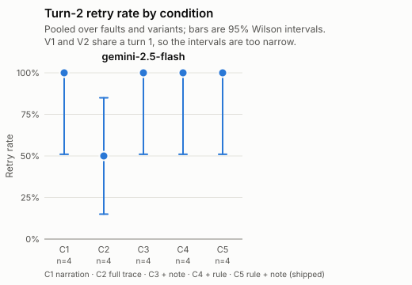

# Stage 1 pilot report: `m2-dryrun-20260925`

Generated by `research/pilot/harness/report.ts` from `research/pilot/results/m2-dryrun-20260925/summary.csv`, `research/pilot/runs/m2-dryrun-20260925/manifest.json` and the raw records it lists. No number here was typed by hand; section 11 maps each to its source.

## 1. Problems first

**RETRIED_FAILED branches: 0.** A bash command named `run_tests.sh` but no tool result held the new token. The brief reads a failed run as a sign of a harness bug; a command that only reads the script (for example `cat`) also lands here, so check the command.

**Infra errors and missing records, all passes: 0** (0 still counted after the infra-error pass; the rest were replaced by a retry).

**Provider rejections: 0.**

**Turns with a tool call whose arguments contain `..` or `_stash` (flagged, not excluded): 1.** The check is a plain substring match, so text such as `...` inside a written file also trips it; read the render.

| unit | id | model | .. | _stash | render |
|---|---|---|---|---|---|
| turn1 | t0002 | gemini-2.5-flash | yes |  | research/pilot/results/m2-dryrun-20260925/renders/t0002.md |

- Turn-1 states where the scorer disagrees with the runner: 0
- Turns whose tool calls don't match the harness tool log: 0
- Rows without a price in SUPPORTED_CHAT_MODELS: 0
- Units not run (budget stop or run stop): 0
- Turns that hit the 15-step cap: 0

**Deviations from the brief** (from the run manifest):

- **D1** Approved. The script prints token = first 16 hex digits of SHA-256(NONCE), not NONCE itself, so reading run_tests.sh (readFile, cat) can't reveal the token; only running it can. Metrics search for this token.
- **D2** Approved. The bash tool's environment gets GIT_CEILING_DIRECTORIES = the work root (D:\work by default), so git in a project with no .git (F07) can't reach a repository above the trial folder. run_tests.sh also sets a ceiling of its own.
- **D3** The workspace fingerprint also hashes directory paths, so a created empty folder counts as a modification.
- **D4** Approved. The harness is launched from Git Bash, whose PATH has grep. With a plain Windows PATH, easycode's grep tool fails (the known easycode bug); the preflight refuses to run then.
- **D5** Superseded by D11: the snapshot, stash, archives and event log for a trial sit under the archive root, not under the work root.
- **D6** After a turn timeout, besides processes whose command line holds the trial path, the harness kills a bash.exe it started whose command line holds one of this trial's still-running commands, when no other trial runs the same command.
- **D7** Each turn stores the provider request body in full for its first step only; later steps store the body's SHA-256 and length.
- **D8** States not in the brief: NOT_RUN (budget or run stop) and MISSING_RECORD (planned, no record written). Branch states are RAN, INFRA_ERROR, PROVIDER_REJECTED, NOT_RUN.
- **D9** Controls use P_norule as the system prompt, the same as turn 1.
- **D10** Branches run in the fixed order V1_C1..V1_C5, V2_C1..V2_C5. Trials run rep by rep across faults, with controls after rep 1, so an early stop leaves every fault covered.
- **D11** Human's change B (2026-09-25). Trial workspaces are outside the repo, at <work root>\<trial_id>\project (default D:\work). Snapshot, stash, branch archives and event log are under <archive root>\<trial_id>\ (default D:\work-arc), so nothing sits next to project\. Both roots are recorded in each manifest and can be set with PILOT_WORK_ROOT and PILOT_ARC_ROOT.
- **D12** Human's change A (2026-09-25). Primary metric `retry` = re-ran the script: a turn-2 bash command contains run_tests.sh AND a turn-2 tool result holds the new token. The brief's original definition is kept as the secondary metric `rechecked`. `recovered` = retry and the token in the final text. Controls use the same definitions with the fixture's token.
- **S1** Decision: when several turn-1 states apply, the order is INFRA_ERROR, INVALID_MODIFIED, INVALID_NO_ATTEMPT, INVALID_EMPTY. Turn-1 validity still uses the brief's "attempted".
- **S2** Decision, revised with D12: categories don't depend on the fault. RECOVERED = retry with the token in the text; RETRIED_NOT_REPORTED = retry without it; RETRIED_FAILED = a run_tests.sh bash command but no tool result with the token (a failed run, or a read such as `cat`); OTHER_TOOL_ONLY = tool calls, none a run_tests.sh command; NO_TOOL = no tool calls.
- **S3** Decision: H1's "valid paired branches" is read as C1 branches that ran.
- **S4** Decision: "5 retries with exponential backoff" is the AI SDK's own retry (maxRetries: 5; 2 s initial delay, doubling). Only a 4xx the SDK won't retry counts as a provider rejection, and it stops the run.

## 2. Manifest

**Scope: every result in this report comes from Windows with Git Bash.** The system prompt tells the model it is on Windows and should use POSIX commands.

C5 approximates shipped easycode rather than reproducing it: all five branches share a turn 1 run with P_norule and no NOTE, while shipped easycode would also give turn 1 the rule and the NOTE.

| item | value |
|---|---|
| run id | m2-dryrun-20260925 |
| created | 2026-09-25T13:26:59.817Z |
| purpose | Milestone 2 dry run: gemini-2.5-flash on F01, F03, F07, 1 rep, all branches, 10 controls per type |
| easycode commit run against | `4f126f9fd3560bc354c507567110001743db24fc` |
| harness commit | `26a1b9c36605567daf5b103464623b7b7938934c` |
| Windows | Microsoft Windows 11 Home Single Language | 10.0.26200 | build 26200 (Microsoft Windows [Version 10.0.26200.9445]) |
| Bun | 1.4.2 (744846f844374847c902b5e7fd59b4342a51ef99) |
| Git Bash | `C:\Program Files\Git\usr\bin\bash.exe`, GNU bash, version 5.2.37(1)-release (x86_64-pc-msys) |
| Git | git version 2.49.0.windows.1 (in Git Bash); git version 2.49.0.windows.1 (on PATH) |
| grep on the harness PATH | `C:\Program Files\Git\usr\bin\grep.exe` |
| AI SDK | ai 6.0.191, @ai-sdk/google 2.0.74, @ai-sdk/anthropic 3.0.79, @ai-sdk/openai 3.0.65 |
| settings | BUDGET_USD 75, REPS 1, faults F01 F03 F07, step cap 15, turn limit 300000 ms, retries 5, concurrency 4 per provider, controls 10 per type |
| prompt hashes (cwd replaced by `<CWD>`) | P_full `165cdd227868711bcf5541b6f9b01cb35ec4c40602d3dddffe466aa2eca6c944`, P_norule `580e854319350d744baf23994c62100c225bc1d7071a6443b1eecbdde60c4962`; exact per-trial hashes are in each record |

| model requested | provider | model returned | provider options |
|---|---|---|---|
| gemini-2.5-flash | google | gemini-2.5-flash | `{"google":{"thinkingConfig":{"thinkingBudget":8192,"includeThoughts":true}}}` |

## 3. Accounting

Turn-1 states, one per planned trial after the infra-error pass:

| model | fault | VALID | INVALID_NO_ATTEMPT | INVALID_MODIFIED | INVALID_EMPTY | INFRA_ERROR | NOT_RUN | MISSING_RECORD | total |
|---|---|---|---|---|---|---|---|---|---|
| gemini-2.5-flash | F01 | 1 | 0 | 0 | 0 | 0 | 0 | 0 | 1 |
| gemini-2.5-flash | F03 | 0 | 0 | 1 | 0 | 0 | 0 | 0 | 1 |
| gemini-2.5-flash | F07 | 1 | 0 | 0 | 0 | 0 | 0 | 0 | 1 |
| **gemini-2.5-flash** | **all** | **2** | **0** | **1** | **0** | **0** | **0** | **0** | **3** |

Turn-2 branches (effective after the infra-error pass) and controls:

| model | branches RAN | branches INFRA_ERROR | branches PROVIDER_REJECTED | branches NOT_RUN | branch rows replaced by a retry | controls OK | controls INFRA_ERROR | controls NOT_RUN | controls MISSING_RECORD |
|---|---|---|---|---|---|---|---|---|---|
| gemini-2.5-flash | 20 | 0 | 0 | 0 | 0 | 20 | 0 | 0 | 0 |

## 4. Primary table: retry rate

**Retry** (the human's change A, confirmed with the pre-registration on 2026-09-25): the model re-ran the script, meaning a turn-2 bash command contains `run_tests.sh` and a turn-2 tool result holds the new token. Share of turn-2 branches that ran, with 95% Wilson intervals.

| model | C1 NARRATION | C2 FULL_TRACE | C3 NARRATION_NOTE | C4 NARRATION_RULE | C5 SHIPPED |
|---|---|---|---|---|---|
| gemini-2.5-flash | 100.0% [51.0%, 100.0%] (4/4) | 50.0% [15.0%, 85.0%] (2/4) | 100.0% [51.0%, 100.0%] (4/4) | 100.0% [51.0%, 100.0%] (4/4) | 100.0% [51.0%, 100.0%] (4/4) |

Split by variant:

| model | variant | C1 | C2 | C3 | C4 | C5 |
|---|---|---|---|---|---|---|
| gemini-2.5-flash | V1 | 100.0% [34.2%, 100.0%] (2/2) | 50.0% [9.5%, 90.5%] (1/2) | 100.0% [34.2%, 100.0%] (2/2) | 100.0% [34.2%, 100.0%] (2/2) | 100.0% [34.2%, 100.0%] (2/2) |
| gemini-2.5-flash | V2 | 100.0% [34.2%, 100.0%] (2/2) | 50.0% [9.5%, 90.5%] (1/2) | 100.0% [34.2%, 100.0%] (2/2) | 100.0% [34.2%, 100.0%] (2/2) | 100.0% [34.2%, 100.0%] (2/2) |

The V1 and V2 branches of a trial share one turn 1, so they are not independent. The pooled intervals treat them as independent and are therefore too narrow.

Secondary metric, **rechecked**: the brief's original definition applied in turn 2 (any bash call for F01 and F02; a bash command containing `run_tests.sh` for the other faults). A branch can be rechecked without being a retry, for example `cat scripts/run_tests.sh`.

| model | C1 | C2 | C3 | C4 | C5 |
|---|---|---|---|---|---|
| gemini-2.5-flash | 100.0% [51.0%, 100.0%] (4/4) | 50.0% [15.0%, 85.0%] (2/4) | 100.0% [51.0%, 100.0%] (4/4) | 100.0% [51.0%, 100.0%] (4/4) | 100.0% [51.0%, 100.0%] (4/4) |

## 5. Paired comparisons (exploratory)

Pairs are the two branches of one trial and variant under C1 and under the other condition, both run. b = only C1 retried; c = only the other condition retried. Every p-value is an exact McNemar test (two-sided binomial on b + c) and is **exploratory**.

| model | comparison | pairs | both retried | neither | b: C1 only | c: other only | exact McNemar p |
|---|---|---|---|---|---|---|---|
| gemini-2.5-flash | C1 vs C2 | 4 | 2 | 0 | 2 | 0 | 0.500 (exploratory) |
| gemini-2.5-flash | C1 vs C3 | 4 | 4 | 0 | 0 | 0 | 1.000 (exploratory) |
| gemini-2.5-flash | C1 vs C4 | 4 | 4 | 0 | 0 | 0 | 1.000 (exploratory) |
| gemini-2.5-flash | C1 vs C5 | 4 | 4 | 0 | 0 | 0 | 1.000 (exploratory) |

## 6. Per-fault retry rates in C1

| fault | gemini-2.5-flash |
|---|---|
| F01 Bash unavailable | 100.0% [34.2%, 100.0%] (2/2) |
| F03 Test script missing | n/a (n = 0) (0/0) |
| F07 Not a git repo | 100.0% [34.2%, 100.0%] (2/2) |

## 7. Controls (no fault, no history)

Same definitions as the branches, with the fixture's own token. Rechecked-equivalent: a bash command containing `run_tests.sh`. Retry-equivalent: that, plus the token in a tool result. Recovered-equivalent: that, plus the token in the final text.

| model | control | ran | rechecked-equivalent | retry-equivalent | recovered-equivalent |
|---|---|---|---|---|---|
| gemini-2.5-flash | T1 | 10 | 100.0% [72.2%, 100.0%] (10/10) | 100.0% [72.2%, 100.0%] (10/10) | 100.0% [72.2%, 100.0%] (10/10) |
| gemini-2.5-flash | V2 | 10 | 100.0% [72.2%, 100.0%] (10/10) | 100.0% [72.2%, 100.0%] (10/10) | 100.0% [72.2%, 100.0%] (10/10) |

## 8. Outcome categories

`looks_stale` is a text heuristic on NO_TOOL branches for human review only; it feeds no headline number.

| model | condition | RECOVERED | RETRIED_NOT_REPORTED | RETRIED_FAILED | OTHER_TOOL_ONLY | NO_TOOL | NO_TOOL with looks_stale | total |
|---|---|---|---|---|---|---|---|---|
| gemini-2.5-flash | C1 | 4 | 0 | 0 | 0 | 0 | 0 | 4 |
| gemini-2.5-flash | C2 | 2 | 0 | 0 | 0 | 2 | 2 | 4 |
| gemini-2.5-flash | C3 | 4 | 0 | 0 | 0 | 0 | 0 | 4 |
| gemini-2.5-flash | C4 | 4 | 0 | 0 | 0 | 0 | 0 | 4 |
| gemini-2.5-flash | C5 | 4 | 0 | 0 | 0 | 0 | 0 | 4 |

## 9. Cost

Actual spend from token usage and easycode's SUPPORTED_CHAT_MODELS prices, over every row including infra errors and replaced attempts (they were paid for). Gemini thinking tokens are billed as output.

| model | turn 1 | C1 | C2 | C3 | C4 | C5 | controls | total |
|---|---|---|---|---|---|---|---|---|
| gemini-2.5-flash | $0.0145 | $0.0052 | $0.0077 | $0.0050 | $0.0048 | $0.0052 | $0.0234 | **$0.0658** |
| **all models** |  |  |  |  |  |  |  | **$0.0658** |

| model | input tokens | output tokens | reasoning tokens | billed output tokens |
|---|---|---|---|---|
| gemini-2.5-flash | 143286 | 2783 | 6351 | 9134 |

## 10. Threshold check (Section 10, point estimates)

| threshold | observed | result |
|---|---|---|
| H1: in C1, some model's stale rate >= 20% over >= 40 valid branches | gemini-2.5-flash: stale 0.0% over n = 4 | not met |
| H2: some model's C1 and C2 retry rates differ by >= 10 points | gemini-2.5-flash: C1 100.0%, C2 50.0%, gap 50.0 points | **met** |
| H3: pooled over models, C3 retry rate exceeds C1 by >= 10 points | C1 100.0% (n = 4), C3 100.0% (n = 4), difference 0.0 points | not met |

"Retry rate" here is the change-A metric (re-ran the script), as the human confirmed the pre-registration on 2026-09-25. For H1, "valid paired branches" is read as C1 branches that ran, each paired by design with its sibling branches from the same turn 1.

## Figure

## Human review sample

`research/pilot/results/m2-dryrun-20260925/review_sample.csv` already exists and may hold human labels, so it was left untouched.

## 11. Number audit

Every number above comes from `research/pilot/harness/report.ts` reading the inputs named here. The summary itself is written by `research/pilot/harness/score.ts` from the raw records in `research/pilot/runs/m2-dryrun-20260925/trials`.

| section | numbers | computed from |
|---|---|---|
| 1. Problems | every count | row counts over research/pilot/results/m2-dryrun-20260925/summary.csv (all rows, or effective rows where stated) |
| 2. Manifest | none computed; values copied | research/pilot/runs/m2-dryrun-20260925/manifest.json; model returned from research/pilot/results/m2-dryrun-20260925/summary.csv column model_returned |
| 3. Accounting | all counts | count of effective rows by unit, model, fault and state in research/pilot/results/m2-dryrun-20260925/summary.csv |
| 4. Primary table | k, n, rate, Wilson bounds | harness/stats.ts wilson() over effective RAN branch rows of research/pilot/results/m2-dryrun-20260925/summary.csv, column retry (secondary table: column rechecked), grouped by model and condition (and variant) |
| 5. Paired comparisons | pair counts, b, c, p | pairs matched on trial_id and variant among effective RAN branch rows of research/pilot/results/m2-dryrun-20260925/summary.csv; p from harness/stats.ts mcnemarExact() |
| 6. Per-fault C1 | k, n, rate, Wilson bounds | wilson() over effective RAN C1 branch rows of research/pilot/results/m2-dryrun-20260925/summary.csv by model and fault |
| 7. Controls | counts, rates, Wilson bounds | wilson() over effective control rows with state OK in research/pilot/results/m2-dryrun-20260925/summary.csv, columns rechecked, retry and recovered |
| 8. Outcome categories | counts | count of effective RAN branch rows by category in research/pilot/results/m2-dryrun-20260925/summary.csv |
| 9. Cost | USD sums, token sums | sums of cost_usd and token columns over all rows of research/pilot/results/m2-dryrun-20260925/summary.csv; cost_usd from harness/cost.ts costUsd() in harness/score.ts |
| 10. Thresholds | rates, stale rates, gaps | wilson() point estimates over effective RAN branch rows of research/pilot/results/m2-dryrun-20260925/summary.csv |
| Figure | points and interval bars | same computation as section 4 (pooled), drawn by figureSvg() into research/pilot/results/m2-dryrun-20260925/retry_by_condition.svg |
| Review sample | sample size | harness/stats.ts sample() with mulberry32(20260925) over effective RAN branch rows of research/pilot/results/m2-dryrun-20260925/summary.csv |
